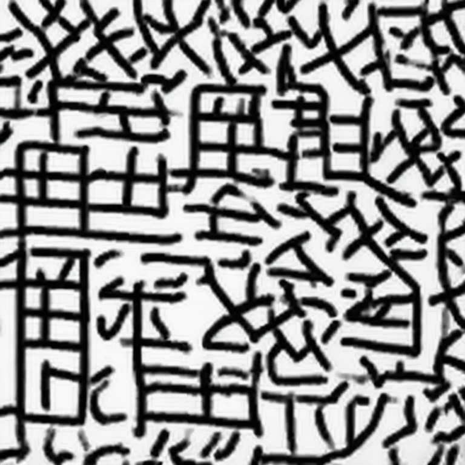
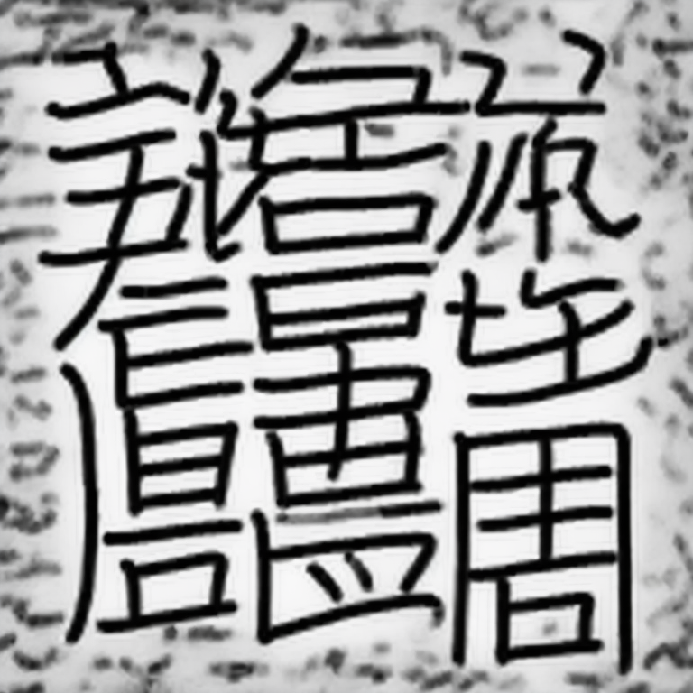
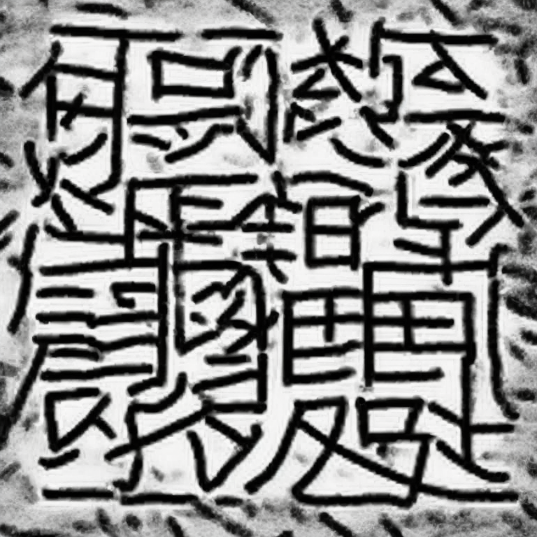
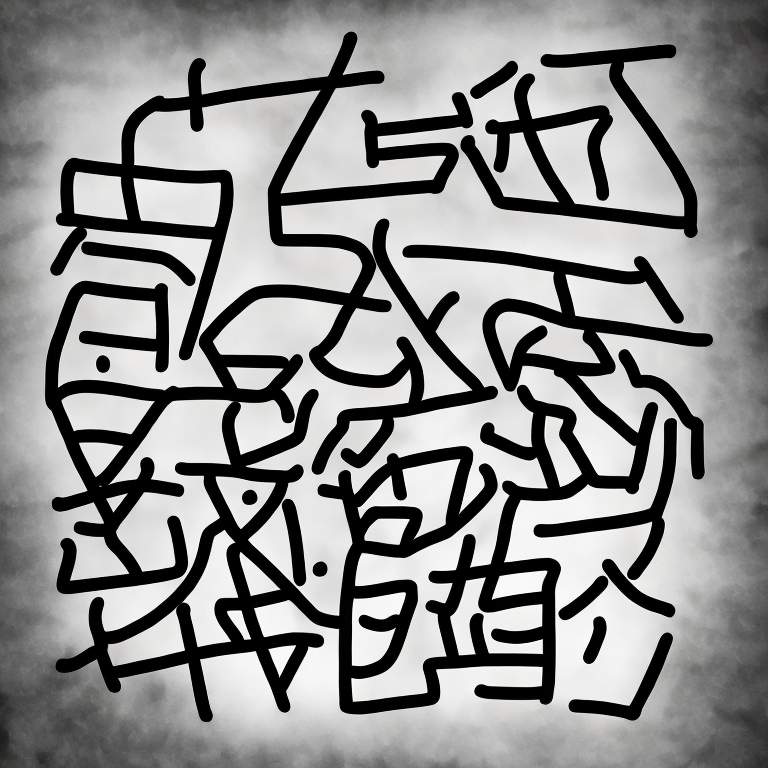
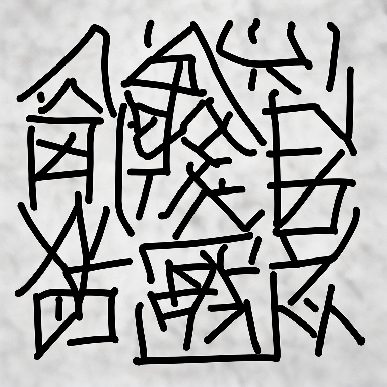
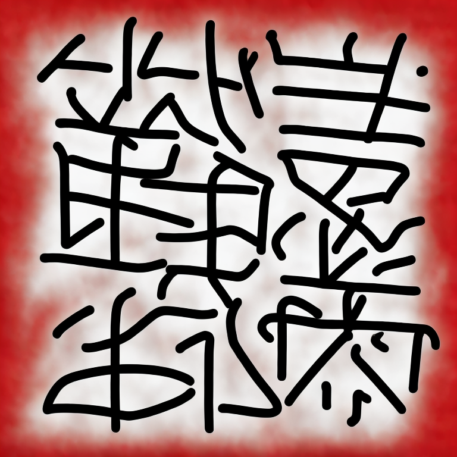

# 🈚️ Kanji Diffusion: Fine-Tuning Stable Diffusion on Kanji Concepts

This project explores the fine-tuning of [Stable Diffusion 2](https://github.com/Stability-AI/stablediffusion) to generate kanji-like images conditioned on their English meanings.

By combining the visual structure of kanji characters with semantic information, we attempt to bridge language and image understanding through generative modeling.

---

## 📂 Dataset

* **Source**: [KanjiVG](https://github.com/KanjiVG/kanjivg/tree/master/kanji)
* **Preprocessing**: Stroke order numbers were removed from the SVG files to focus on clean character structure.
* **Meaning Mapping**: English meanings were extracted from [KANJIDIC2](https://www.edrdg.org/kanjidic/kanjidic2.xml.gz).
* **Final Dataset**: Uploaded to Hugging Face:
  👉 [kentarrito/kanji\_dataset](https://huggingface.co/datasets/kentarrito/kanji_dataset)

Each training sample pairs a kanji image with one of its English meanings as the prompt.

---

## 🔧 Fine-Tuning

Two variants of Stable Diffusion 2 were fine-tuned:

1. **Full Fine-Tuning**

   * Hugging Face Model: [stable-diffusion-2-kanji-finetune](https://huggingface.co/kentarrito/stable-diffusion-2-kanji-finetune)

2. **LoRA Fine-Tuning**

   * Hugging Face Model: [stable-diffusion-2-kanji-finetune-lora](https://huggingface.co/kentarrito/stable-diffusion-2-kanji-finetune-lora)

Training was conducted using the English meanings as text prompts and kanji SVGs (converted to PNG) as image targets.

---

## 🖼️ Generated Samples

The generated images exhibit kanji-like strokes and spatial structure, though they are not exact reproductions of real kanji characters.

### Full Fine-Tuning

| Prompt        | Generated Image             |
| ------------- | --------------------------- |
| "the coolest looking guy in the world"     |      |
| "Engineer"  |  |
| "Fire Fighter"   |     |

### Lora Fine-Tuning

| Prompt        | Generated Image             |
| ------------- | --------------------------- |
| "the coolest looking guy in the world"     |      |
| "Engineer"  |  |
| "Fire Fighter"   |     |

*(Images are for illustrative purposes — real generations may vary)*

---

## 📦 How to Use

```python
from diffusers import StableDiffusionPipeline
import torch

pipe = StableDiffusionPipeline.from_pretrained(
    "kentarrito/stable-diffusion-2-kanji-finetune-lora", 
    torch_dtype=torch.float16
).to("cuda")

image = pipe(prompt="tree").images[0]
image.show()
```

For the LoRA model, make sure to load the base SD2.0 and apply LoRA weights accordingly.

---

## 📈 Future Work

* Improve structural resemblance to actual kanji characters.
* Explore T2I-Adapter or ControlNet to guide generation using kanji stroke order.
* Evaluate recognition accuracy with OCR or human annotators.

---

## 📜 License

Dataset and code are released under MIT License.
KanjiVG and KANJIDIC2 are under their respective open licenses — please refer to their repositories.

---

## 🙏 Acknowledgments

* [KanjiVG](https://github.com/KanjiVG/kanjivg)
* [KANJIDIC2](http://www.edrdg.org/wiki/index.php/KANJIDIC_Project)
* [Hugging Face Diffusers](https://github.com/huggingface/diffusers)
* [Stable Diffusion 2](https://github.com/Stability-AI/stablediffusion)

